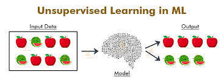
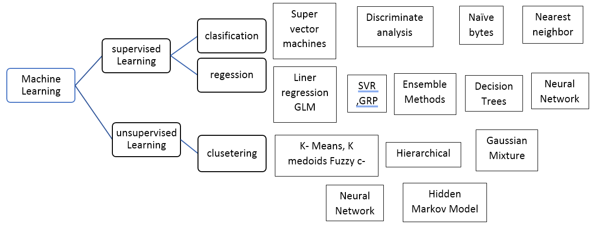

Different type of machine learning

- Supervised learning
- Unsupervised learning
- Reinforcement learning

## Supervised learning

In suppervised learing first we give some raw information (Training data) to the machine learning model, and then it will make the rules for us.
This training dataset contain both Input data and correct Output data.

Then machine learning model will try to adjust its error to minimum amount, through loss function by increasing accuracy. 

Later when we need to enter the input data it will give the output data we need.

so it like mapping input(x) to output(y).

`y = f(x)`

Supervised learning can be divied into two groups:
- Regression
- Classification

### **Regression**

By using reggresion we can predict the value of outputs based on the value of input.
So its like when we give both input and output data machine learing model will comes with way to undersyand the relastionship between 
input and outputs or depended variable and indpeneded variable.

There are two terms we used in regression
Feature and labels.

- Feature is like inputs, which is data give when need to predict output.
- Labels are the output data which going predict from the model. 

For exapmle if take a house price prediction, then feature are area of the house, location of the house and some others and labels is the price of the house which is the output we get.

(Note that there can either one or more labels. It is not limited to one)

Most commonly used regression algorithms are Linear regression, logistical regression, and polynomial regression.

### **Classification**

Classification is simply the process of finding the correct label for the input data.

For example , if we have a picture of a dog, and we want to know what kind of animal it is, we can use classification.
For do that we can prepare set of data of animals, then label them according to their name. 
After that we can give these data to model and it will make rules for us. 
So once it fininshed, when we can show dog picture to model it can come up with prediction on what kind of animal it can be.

Mostly common used classification algorithm is linear classifiers, support vector machines (SVM), decision trees, k-nearest neighbor, and random forest

Let's talk about them in detail later.

Supervised learning is the most common type of machine learning. It has many uses cases.
So if have both input and output data, we can get a good result using supervised learning.
But we dont have luck to having both type of data all the time. Thats where unsuppervised learini comes in.

## Unsupervised learning

In unsupervised learning when data is given, machine learning model comes up with ways group/cluster unlabeled data using algorithms.

Common approches for unsupperised learning are clustering, dimensionality reduction, and data visualization.

Unsuppervised learingn can be used for, 
- computer vision activities like image recognition 
- News article catogorizing 
- Anomaly detection 
- build customer persona profiles based on theory habbits
- Recommendation Engines

Common Algorithms and techniques used in Suppervised and UNnsupervised learninig.

## Reinforcement learning

